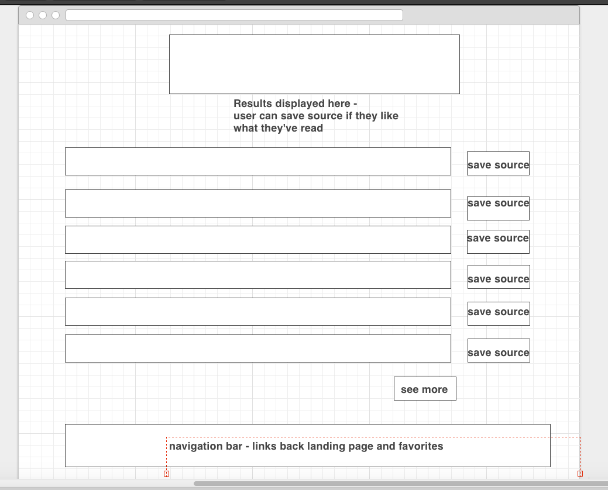
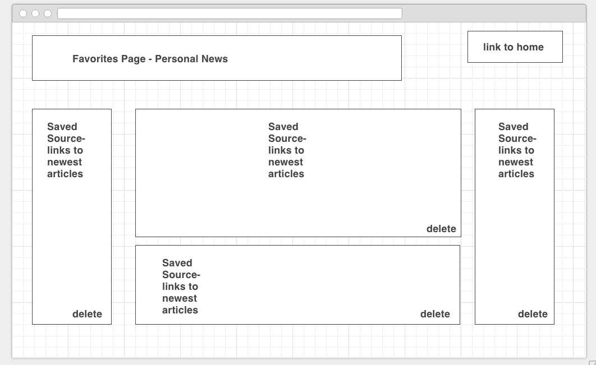

# Good News

Easier access to the latest news stories from the top sources - Good News lets you build a personal newspaper. Browse news sources by category based on personal interest, select a source and you get instant access to the latest articles from that source! Add that source to your personal newspaper and you can view the top 4 articles (and more) from as many sources as you want, all in one place! If you like sports, business and technology, you can have that news all in centralized for quick viewing! Want to compare trending topics and views taken by different sources? Good News is a neutral platform that lets you do just that. 

My approach to this was mainly to create something user-friendly. It was my first time trying to combine front and back-end Javascript as well as authentication and a log-in, so there was a learning curve there. 

Technologies Used:
    * node.js
    * Express
    * MongoDB
    * Node-Fetch
    * News API
    * Javascript/jQuery
    * HTML/CSS
    * Bootstrap
    
Wireframes - they helped me to imagine my project, but I ended up taking a different approach based on circumstances.

While I am happy with the result I achieved, I would have liked to create additional search/filter functionality for the user for news articles (sort by most popular or trending instead of only returning latest news) as well as improving the overall flow of the user experience
